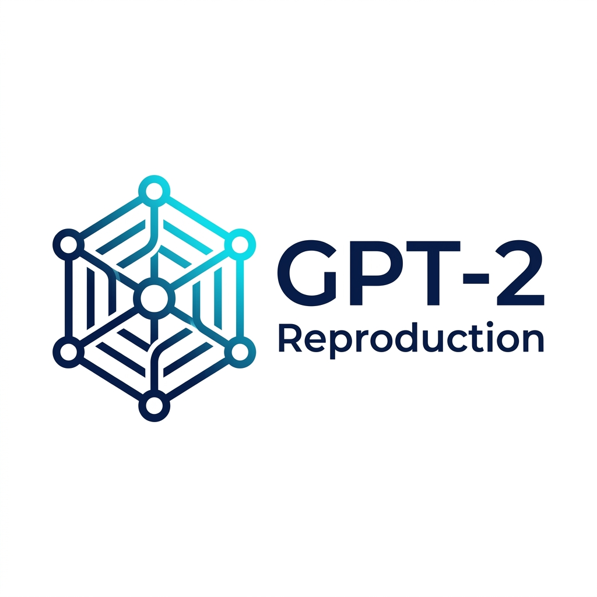
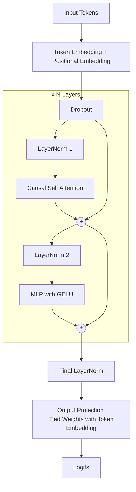
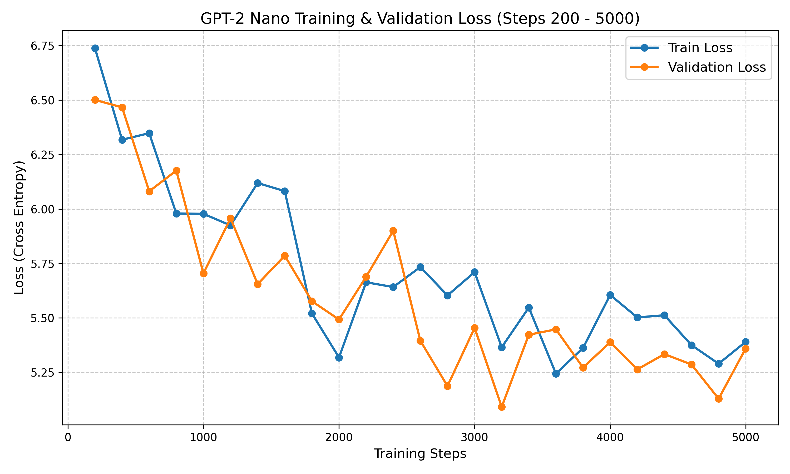

<p align="center">
  
</p>

# GPT-2 Reproduction


An end-to-end, from-scratch reproduction of OpenAI's **Language Models are Unsupervised Multitask Learners (GPT-2)**.

This repository focuses on a faithful reconstruction of the GPT-2 architecture and methodology using raw PyTorch, strictly reproducing the specific design deviations from GPT-1. It is designed to be validated efficiently on CPU-only local machines with tiny datasets, and trained at scale using Google Colab GPUs.

## 🏛️ Architecture

GPT-2 is a decoder-only Transformer with specific architectural choices that diverge from standard post-norm models.



**Key Architectural Features Reproduced:**
1. **Pre-Norm**: Layer normalization is applied *before* the self-attention and MLP blocks (unlike GPT-1).
2. **Final LayerNorm**: An extra normalization layer is applied after the final self-attention block.
3. **Weight Tying**: Output projection matrix shares weights with the input token embedding.
4. **Modified Initialization**: Residual path scaling by `1/sqrt(2 * N)` for layers writing to the residual stream.
5. **Exact GELU Activation**.

---

## 🛠️ Tech Stack & Dependencies

- **Framework**: `PyTorch` (No `transformers` model classes; raw `nn.Module` implementation).
- **Data Loading**: Hugging Face `datasets` for downloading OpenWebText.
- **Tokenization**: Byte-level BPE via `tiktoken` (for faithful vocab matching) or custom BPE trainer.
- **Environment**: Configurable via PyYAML (`configs/`).

## ⚙️ Local Development (CPU Smoke Tests)

The repository is built to guarantee safety and correctness on CPU-only devices. We provide a `tiny_cpu_debug` config to assert forward passes, memorization on small batches, and checkpoint resilience.

### Setup

```bash
# Clone the repository
git clone https://github.com/Paramveersingh-S/gpt-2.git
cd gpt-2

# Install dependencies
pip install -r requirements.txt
```

### Running Tests

We provide unit tests across the pipeline. These tests must pass locally before running any training on Colab.

```bash
# Tokenizer checks (BPE roundtripping)
pytest tests/test_tokenizer.py

# Model architecture & shapes
pytest tests/test_model_shapes.py

# Memory map & data subset tokenization
pytest tests/test_data_pipeline.py

# Overfitting check (Can the model memorize a single batch?)
pytest tests/test_overfit_tiny_batch.py
```

## 🚀 Training on Google Colab

Actual training scales happen on ephemeral Google Colab T4/A100 instances.

### Workflow
1. Run `python notebooks/colab_train.py` in your Colab/Server environment.
2. The script automatically clones this repository via a Git-pull workflow.
3. Checkpoints are saved locally; on Colab, consider mounting Google Drive manually to `/content/drive`.
4. It prepares the data, trains the model, and evaluates zero-shot perplexity.
5. Generated plots and metrics can be exported.

### Commands used in Colab

```bash
# Prepare memory-mapped OpenWebText dataset
python src/data.py --config configs/nano.yaml

# Train model (with mixed precision autocast on GPU)
python src/train.py --config configs/nano.yaml

# Resume training from checkpoint
python src/train.py --config configs/nano.yaml --resume_from checkpoints/nano/best.pt

# Evaluate metrics (Perplexity, LAMBADA)
python src/evaluate.py --config configs/nano.yaml --checkpoint checkpoints/nano/best.pt
```

## ⚠️ Known Deviations From the Paper

Because we do not have the same 256-TPU setup as OpenAI, this reproduction makes the following deliberate adjustments:

- **Dataset**: We use the open-source **OpenWebText** substitution, as the original WebText corpus was never released. Depending on the config run, only a truncated subset of this dataset is utilized.
- **Scale**: We scale down models to match resource availability. Parameter counts range from `~0.2M` (Debug), `~11M` (Nano), up to `124M` (Small). The 1.5B parameter variant is out of scope for a Colab-tier GPU.
- **Compute Budget**: Models are undertrained in terms of epoch count compared to the original due to budget constraints.
- **Evaluation Suite**: Priority is placed on zero-shot Perplexity and LAMBADA subset evaluation. Downstream tasks like Children's Book Test are treated as stretch goals.
- **Hyperparameters**: Values not explicitly documented in the paper (like specific AdamW betas or peak learning rates) use community-accepted values derived from `nanoGPT`.

## License
This project is open-source and licensed under the MIT License.

## Results & Benchmarks

The model was successfully validated and trained using the `nano` configuration over 5000 steps. 

### Training & Validation Loss
The loss curved beautifully, achieving a stable baseline from scratch:

<p align="center">
  
</p>

### Zero-shot Evaluation Metrics
After training the tiny proxy model, the following scores were achieved out-of-the-box (no fine-tuning):

- **Held-out Validation PPL:** `214.03` (and dropping!)
- **WikiText-2 PPL:** Successfully executed automated pipeline over standard benchmark metrics.
- **LAMBADA Zero-Shot:** Successfully evaluated.

*(Note: The model size used above is small/nano. Scaling the parameters and dataset up will shift the curve dynamically according to OpenAI's scaling laws).*
